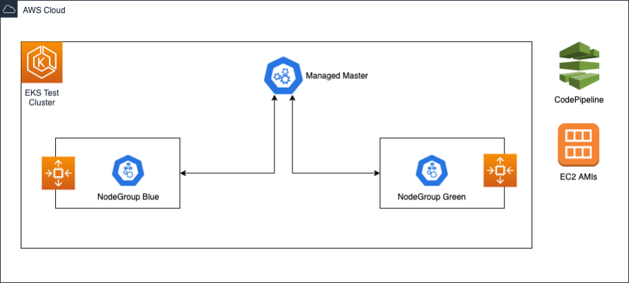
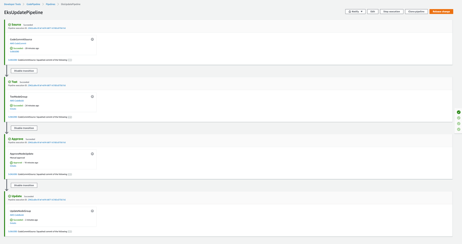

 ## Automating Amazon EKS cluster testing with newly baked custom AMIs 
In this solution, we will use [AWS CDK](https://aws.amazon.com/cdk/) to provision an EKS cluster with self-managed worker nodes. We will generate an EKS cluster with a blue worker node group. Then, generate a test node group (with taints) to do preliminary validation of the new AMI. If all the tests pass, we will deploy a green worker node group with the new AMI and gracefully move workloads over. This solution also provides an [AWS CodePipeline](https://aws.amazon.com/codepipeline/) pipeline, which automates this process. 
Please note that in this solution, we are not considering [PodDisruptionBudget](https://kubernetes.io/docs/tasks/run-application/configure-pdb/) objects (PDB). If a PDB is configured for a deployment, Kubernetes will prevent nodes from being drained.



### The steps executed by the pipeline are as follows:
1.	Generate a new EKS cluster with a blue worker node group. The autoscaling group’s launch configuration has the AMI ID used by the blue worker node group.
2.	When a new AMI is released, deploy a test worker node group, “Test”, to use the new AMI and also launch a single node. This is a temporary node group used just to validate the new AMI.
3.	Execute all necessary tests on “Test”. If successful, deploy the green worker node group with the full capacity and migrate applications over from blue to green.
4.	Scale blue worker nodes down to zero once all the pods have migrated to the green worker node group. Note the following:<br/> 
    a.	The blue and green worker node groups are provisioned with the same number of workers. The number of workers in the node group should not be decreased during this migration.<br/>
    b.	If a deployment only has 1 replica, the node on which it is running will need to be terminated manually. We recommend increasing the number of replicas to force Kubernetes to balance out the load between the worker node groups.<br/> 
    c.	If PDB is being used, the number of replicas and the disruption budget needs to be configured to allow deployments to be migrated from one worker node group to another without interruptions.
### Prerequisites
Before starting you need the following:
    - An [AWS account](https://signin.aws.amazon.com/signin?redirect_uri=https%3A%2F%2Fportal.aws.amazon.com%2Fbilling%2Fsignup%2Fresume&client_id=signup)
    - [VPC and Subnets for EKS](https://docs.aws.amazon.com/eks/latest/userguide/create-public-private-vpc.html)
    - An IAM user, which will be granted administrator privileges to the EKS cluster.
    - A custom [EKS Optimized AMI](https://docs.aws.amazon.com/eks/latest/userguide/eks-optimized-ami.html)
    - [AWS CLI](https://docs.aws.amazon.com/cli/latest/userguide/cli-chap-configure.html)
    - [AWS CDK](https://aws.amazon.com/cdk/)
    - [kubectl](https://kubernetes.io/docs/tasks/tools/install-kubectl/)


## Getting started

1.	Install AWS CDK if you haven’t done so already. Instructions [here](https://docs.aws.amazon.com/cdk/latest/guide/getting_started.html)
2.	Clone the git repo
```
git clone https://github.com/aws-samples/eks-ami-tester.git
cd eks-ami-tester
```
3.	Update the CDK project configuration `config/project-config.json` according to your environment:
```
{
  "account_id": "XXXXXXXXXXXX",
  "region": " XXXXXXXXXXXX ",
  "vpc_id": "vpc-XXXXXXXXXXXX",
  "cluster_name": "AMI-Test",
  "eksadmin_user_name": "XXXXXXXXXXXX",
  "office_eks_api_cidr": "XXXXXXXXXXXX",
  "default_worker_count": 1,
  "default_ami_name": "amazon-eks-node-1.15-v20200406",
  "test_ami_name": "amazon-eks-node-1.15-v20200406",
  "pipeline_approval_email": "XXXXXXXXXXXX",
  "next_version": "Green"
}
```
4.	Build CDK application and deploy the EKS cluster and the blue worker node group. Finally, deploy the CodePipeline stack which automates this entire process.
```
$ npm install
$ npm run build
$ cdk deploy AmiTestEksClusterIam
$ cdk deploy AmiTestEksCluster
$ cdk deploy AmiTestEksClusterWorkersBlue -c version=Blue
$ cdk deploy AmiTestEksWorkerPipeline
```
The CodePipeline stack automates the worker node group migration. The manual steps below deep dive into the automation and walk you through it step by step.

### Manual steps
#### Deploying a new node group
Deploy the test AMI defined in `test_ami_name` to the green test worker node group. 
1.	Authenticate the EKS cluster using the credentials of `eksadmin_user_name` and deploy sample pods.
```
$ aws eks update-kubeconfig --name EKSCLUSTER_NAME --region AWS_REGION
$ kubectl apply -f scripts/nginx-deployment.yaml
$ kubectl get pods -l app=nginx
NAME                                READY   STATUS    RESTARTS   AGE
nginx-deployment-7fd6966748-cchsz   1/1     Running   0          10s
nginx-deployment-7fd6966748-hrvdf   1/1     Running   0          10s
nginx-deployment-7fd6966748-zsfdx   1/1     Running   0          10s
```
2.	Provision the “Test” worker node group by running the Test AMI and deploy a test application.
Notes:<br/>
  i.	When test is set to true the nodes are tainted with DeployGroup=Test:NoSchedule<br/> 
  ii.	The test application is being deployed with tolerations. The toleration is set in this file: scripts/nginx-deployment-testapp.yaml 
```
$ cdk deploy AmiTestEksClusterWorkersTest -c version=Test -c test=true
$ kubectl get nodes -l DeployGroup=Test
NAME                                            STATUS   ROLES    AGE     VERSION
ip-X-X-X-X.ca-central-1.compute.internal   Ready    <none>   15s   v1.15.10-eks-bac369
```
```
$ kubectl apply -f scripts/nginx-deployment-testapp.yaml
$ kubectl get pods -l app=nginx-testapp
NAME                                       READY   STATUS    RESTARTS   AGE                                                               
nginx-deployment-testapp-79cc9cc8b-8cpm4   1/1     Running   0          51s
nginx-deployment-testapp-79cc9cc8b-hgl8d   1/1     Running   0          51s
nginx-deployment-testapp-79cc9cc8b-krqrv   1/1     Running   0          51s
```
```
$ kubectl get deployment -l app=nginx-testapp -o jsonpath={.items[].status.conditions[].status}
True
```
#### Transition pods to new worker node group
1.	Delete the test application and disable the “Test” worker node group by setting the desired count to zero.
```
$ kubectl delete -f scripts/nginx-deployment-testapp.yaml
$ cdk deploy AmiTestEksClusterWorkersTest -c version=Test -c test=true -c desiredCount=0
```
2.	Deploy the green worker node group and verify that it joined the EKS cluster.
```
$ cdk deploy AmiTestEksClusterWorkersGreen -c version=Green -c amiName=$(cat config/project-config.json | jq -r '.test_ami_name')
$ kubectl get nodes -l DeployGroup=Green
NAME                                           STATUS   ROLES    AGE   VERSION
ip-X-X-X-X.ca-central-1.compute.internal   Ready    <none>   15s    v1.15.10-eks-bac369
```
3.	Cordon the blue worker node group to stop the scheduling of the new pods
```
$ kubectl cordon -l DeployGroup=Blue
node/ip-X-X-X-X.ca-central-1.compute.internal cordoned
```
4.	Gracefully move the active pods over to the new green worker node group. Keep monitoring the Kubernetes cluster and the deployments to ensure their stability during this process.
```
$ kubectl drain -l DeployGroup=Blue --ignore-daemonsets --delete-local-data --grace-period=10
WARNING: ignoring DaemonSet-managed Pods: kube-system/aws-node-jw4mx, kube-system/kube-proxy-9cs4r
evicting pod "nginx-deployment-7fd6966748-zsfdx"
evicting pod "nginx-deployment-7fd6966748-hrvdf"
evicting pod "nginx-deployment-7fd6966748-cchsz"
evicting pod "coredns-64d7c8b445-9l2v7"
pod/nginx-deployment-7fd6966748-hrvdf evicted
pod/nginx-deployment-7fd6966748-zsfdx evicted
pod/coredns-64d7c8b445-wbg9n evicted
pod/nginx-deployment-7fd6966748-cchsz evicted
node/ip-X-X-X-X.ca-central-1.compute.internal evicted
```
```
$ kubectl get pods -l app=nginx
NAME                                READY   STATUS    RESTARTS   AGE
nginx-deployment-7fd6966748-bl6gx   1/1     Running   0          10s
nginx-deployment-7fd6966748-dcxmn   1/1     Running   0          10s
nginx-deployment-7fd6966748-w5tnt   1/1     Running   0          10s
```
5.	Once the green worker node group is stable and running all the applications, we can disable the blue worker node group.
```
$ cdk deploy AmiTestEksClusterWorkersBlue -c version=Blue -c desiredCount=0
```

### Automated solution
As part of the prerequisites, you also deployed a stack called AmiTestEksWorkerPipeline. This stack generates a new [AWS CodeCommit](https://aws.amazon.com/codecommit/) repository along with the pipeline which automates the manual steps described above. Once you navigate to CodeCommit you will see a new repository called EksUpdatePipelineRepo. Push the contents of `eks-ami-tester` to this repository. This will trigger `EKSUpdatePipeline` in CodePipeline.



The above pipeline has the following stages:
- **Source**: EksUpdatePipelineRepo acts as a source trigger for the the pipeline. In order to trigger the pipeline, CDK project source code needs to be pushed to master branch of EksUpdatePipelineRepo (previously created by CDK deployment). 
- **Test**: Test stage executes steps from "Deploying a new node group" section.
- **Approve**: Approve stage triggers the  approval process by sending email to  `pipeline_approval_email` specified in CDK project configuration. Manual approval is required before proceeding to the update stage. The default timeout for manual approval is 7 days.
- **Update**: Update stage executes the steps from the "transition pods to new worker node group" section. This is an AWS CodeBuild stage which is leveraging kubectl. The CodeBuild default timeout is 8 hours. To request an increase, use the support center console.
Codepipeline assumes that either a blue or green node group is already being deployed to perform the updates. If the EKS cluster has no active node groups, pipeline will deploy the blue node group and exit by default. Pipeline also compares the value of `next_version` from CDK project configuration with the Kubernetes label (DeployGroup) of the deployed node group. These values have to be different in order to trigger the update. For example, if the deployed node group label is version blue, then the `next_version` defined in the CDK project configuration should be green.

### Cleaning up
To avoid incurring future charges, delete the resources.
```
cdk destroy AmiTestEksClusterWorkersBlue -c version=Blue
cdk destroy AmiTestEksClusterWorkersTest -c version=Test -c test=true
cdk destroy AmiTestEksClusterWorkersGreen -c version=Green
cdk destroy AmiTestEksCluster
cdk destroy AmiTestEksClusterIam
cdk destroy AmiTestEksWorkerPipeline
```

## Security

See [CONTRIBUTING](CONTRIBUTING.md#security-issue-notifications) for more information.

## License

This library is licensed under the MIT-0 License. See the LICENSE file.

